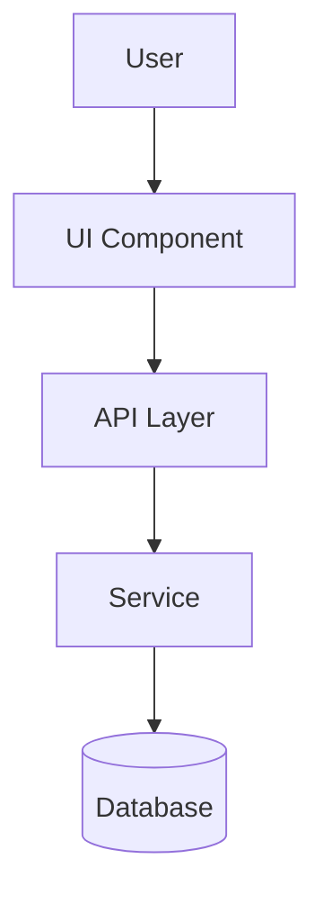

# Architecture (Medium Template)

> This is a reference template. Use it as the structure for `docs/ARCHITECTURE.md` when the PRD complexity calls for a medium doc. It includes everything in the lightweight template plus additional sections for data flow, API contracts, state management, error handling, and external integrations. Fill in each section based on the PRD and approved tech stack decisions. Remove this notice before writing the final file.

---

# Architecture

## Overview

One paragraph describing what this project does and its primary technical goals.

## Tech Stack

| Layer | Choice | Reason |
|-------|--------|--------|
| Language | ... | ... |
| Framework | ... | ... |
| Database | ... | ... |
| State management | ... | ... |
| Styling | ... | ... |
| Auth | ... | ... |

Add or remove rows as appropriate for the project type.

## File & Folder Structure

```
project-root/
├── src/
│   ├── components/    # Reusable UI components
│   ├── pages/         # Top-level route pages
│   ├── services/      # External API and data access
│   ├── store/         # Global state
│   └── utils/         # Shared helpers and constants
└── docs/
    └── ARCHITECTURE.md
```

Describe the purpose of each top-level directory in 1–2 sentences. Adjust the tree to reflect the actual planned structure — do not leave placeholder paths that don't apply.

## Key Components & Responsibilities

For each major component or module, describe:
- What it owns and does
- What it explicitly does NOT own (boundaries matter as much as responsibilities)

### ComponentName
...

### ModuleName
...

## Data Flow

Mermaid diagram showing how data moves through the system for the primary use case(s). Use one diagram per distinct flow if there are multiple non-obvious paths.



Follow the diagram with a prose description of any non-obvious flows, error paths, or async behavior that the diagram doesn't fully capture.

## API Contracts

One entry per major endpoint or service boundary. Focus on the contract — inputs, outputs, and failure modes — not implementation.

### METHOD /path
- **Input**: `{ field: type, ... }`
- **Output**: `{ field: type, ... }`
- **Errors**: `404` if ..., `422` if ..., `401` if ...

## State Management

- What state management approach is used and why
- What lives in global state vs local component state vs server/cache state
- What explicitly does NOT belong in state (avoid common pitfalls for the chosen library)

## Error Handling Strategy

- How errors are caught and propagated at each layer (UI, API, service, database)
- What the user sees vs what gets logged
- Any error boundary patterns, fallback UI, or retry logic used
- How unexpected errors are handled vs expected/typed errors

## External Services & Integrations

| Service | Purpose | Auth method | Notes |
|---------|---------|-------------|-------|
| ... | ... | API key / OAuth / ... | ... |

## Decisions & Rationale

One entry per resolved tech stack decision or meaningful architectural choice. Do not document decisions that were obvious or had no real alternatives.

### Decision: <short title>
**Chosen**: X
**Alternatives considered**: Y, Z
**Reason**: Why X was chosen over the alternatives, including any project-specific constraints that influenced the decision.

### Decision: <short title>
...
